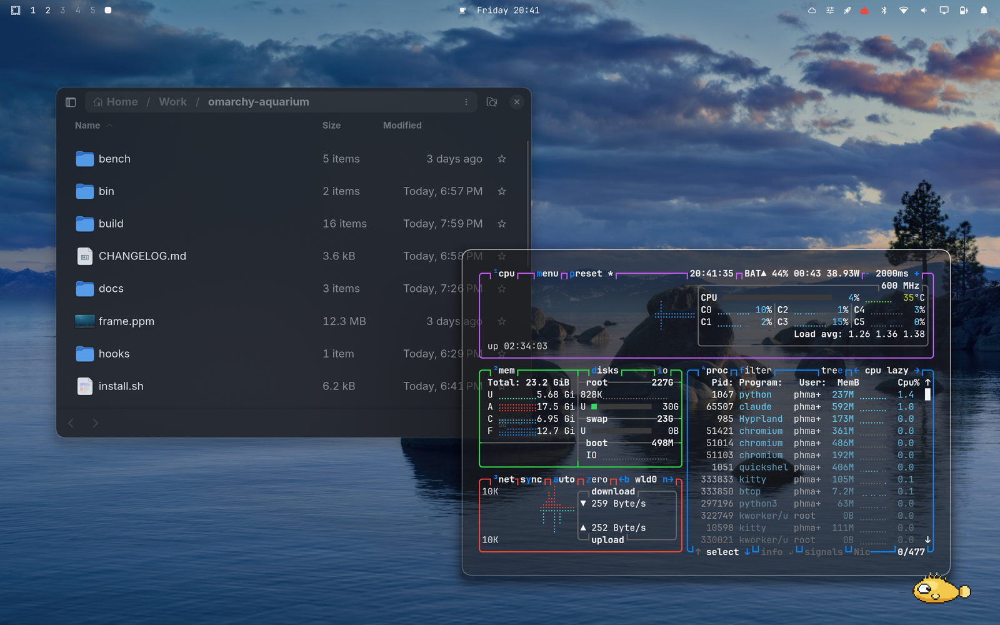
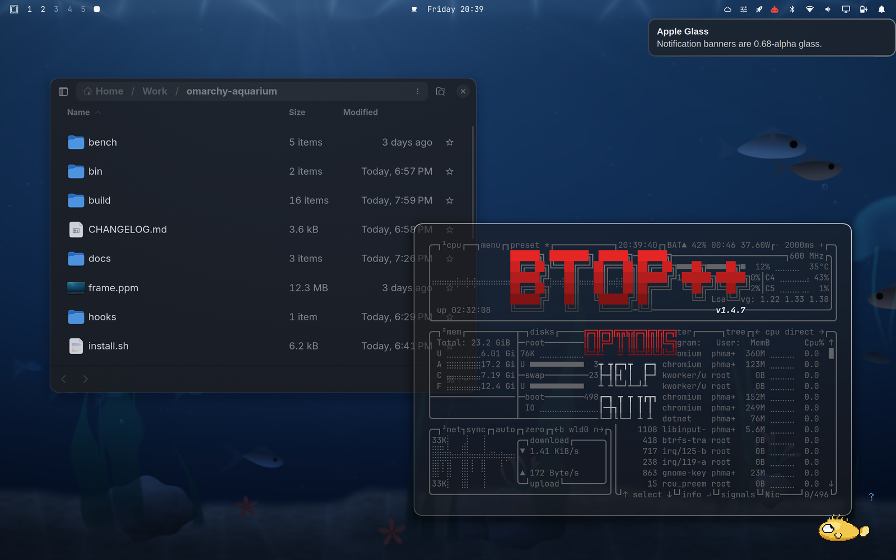

# Apple Glass

A macOS-inspired **dark** theme for [Omarchy](https://omarchy.org). Deep
translucent blur, squircle corners, vibrancy-tuned surfaces, and a palette
built from Apple's dark-mode system colors.


The part a screenshot cannot show: **the blur was tuned against moving water.**
Every number below was picked by A/B comparison with the
[omarchy-aquarium](https://github.com/macarchy/omarchy-aquarium) animated
background running underneath — a live GLSL underwater scene, not a still
wallpaper. That is why `vibrancy` came down to 0.18 (at 0.28 the panes glow
blue over the saturated water instead of reading as neutral graphite) and why
`noise` stays at 0.02 (static grain shimmers against a moving backdrop). The
theme still looks correct over a static wallpaper; it was simply not tuned
there.

Pairs with **[apple-glass-light](https://github.com/macarchy/apple-glass-light)**.
The two switch automatically on the sun (sunrise and sunset for your location,
or a fixed window) via `macarchy-auto-appearance` from
[macarchy-core](https://github.com/macarchy/macarchy-core), the same way macOS's
"Auto" appearance setting works. Choosing any *other* theme is treated as an
override, so the timer never yanks a deliberate choice out from under you.

## Install

```sh
omarchy-theme-install https://github.com/macarchy/apple-glass
```

## Palette

macOS dark-mode system colors, adapted to Omarchy. Neutral graphite surfaces, so
translucency reads as glass rather than as a tint.

| Role | Hex | | Role | Hex |
| --- | --- | --- | --- | --- |
| `accent` | `#0a84ff` | | `red` | `#ff453a` |
| `selection` | `#3a3a3c` | | `orange` | `#ff9f0a` |
| `muted` | `#636366` | | `yellow` | `#ffd60a` |
| `background` | `#1d1d1f` | | `green` | `#32d74b` |
| `dark_background` | `#141416` | | `cyan` | `#64d2ff` |
| `darker_background` | `#0b0b0d` | | `blue` | `#0a84ff` |
| `lighter_background` | `#2c2c2e` | | `magenta` | `#bf5af2` |
| `foreground` | `#f5f5f7` | | `brown` | `#ac8e68` |
| `dark_foreground` | `#8e8e93` | | `bright_red` | `#ff6961` |
| `light_foreground` | `#d1d1d6` | | `bright_yellow` | `#ffe066` |
| `bright_foreground` | `#ffffff` | | `bright_green` | `#5ce65c` |
| | | | `bright_cyan` | `#8be0ff` |
| | | | `bright_blue` | `#409cff` |
| | | | `bright_magenta` | `#da8fff` |

Window borders are a rim light rather than a frame — a bright edge fading to
nearly nothing across the pane:

```
active   rgba(ffffffcc) → rgba(ffffff40) at 135°
inactive rgba(ffffff1f)
```

## The material

From `hyprland.lua`, applied after Omarchy's own look-and-feel so it wins while
this theme is current and is gone the moment you set another one. Nothing
outside the theme directory is touched.

| Setting | Value | Why |
| --- | --- | --- |
| `blur.size` / `blur.passes` | `20` / `4` | The deep macOS-style material. 8/3 read as clear glass, 12–16/3 as light frost. The 4th pass is the only real cost; size alone is free in dual-kawase. |
| `blur.xray` | `true` | Every pane blurs straight through to the background layer, not to the windows behind it — the whole desktop is glass over one scene, and stacked translucency stops compounding. |
| `blur.ignore_opacity` | `true` | Apps that paint their own translucency get the material too. |
| `blur.vibrancy` | `0.18` | Backed off from 0.28: the aquarium is already saturated, and at that level the panes picked up its blue. |
| `blur.vibrancy_darkness` | `0.1` | |
| `blur.noise` | `0.02` | Real frosted glass is never perfectly smooth; also hides banding. Low, because static grain shimmers over motion. |
| `blur.contrast` / `blur.brightness` | `1.0` / `1.0` | Neutral. Boosting contrast made caustic highlights pulse behind text. |
| `blur.popups` | `true` (`popups_ignorealpha 0.4`) | |
| `rounding` / `rounding_power` | `14` / `2.6` | `rounding_power > 2` bends the corner into a squircle, the continuous curve macOS uses, instead of a circular quarter-arc. |
| `border_size` | `1` | A hairline; on glass the edge is a highlight, not a frame. |
| `gaps_in` / `gaps_out` | `6` / `12` | |
| `shadow` | range `32`, power `3`, offset `0 8`, `rgba(0000006e)` | Wide, soft, dropped slightly downward, like a macOS window shadow. |
| `misc.session_lock_blur` | `true` | Glass over the desktop while locked. |

**Window opacity.** Regular windows run `0.90` focused / `0.82` unfocused.
Terminals are the exception: they carry their own glass (`0.58` background alpha
in `alacritty.toml`, `kitty.conf` and `foot.ini`) so glyphs stay fully opaque
while the background lets light through. The compositor therefore leaves them at
`1.0` / `0.95` and skips blurring them, which keeps the scene behind crisp
instead of frosting it into a featureless slab.

Those terminals are matched by Omarchy's own `terminal` tag
(`default/hypr/apps/terminals.lua`) rather than a hand-written class list.
Omarchy launches TUIs and its own terminal windows under dedicated app-ids, so
the tag's pattern ends in `org\.omarchy\..*|TUI\..*`, so every one of those is
covered the day it appears. A spelled-out regex is not: it misses each new TUI,
and it missed ghostty, wezterm and foot's `org.codeberg.dnkl.foot` app-id
outright. The miss shows up as one terminal rendering as an opaque slab beside
its glassy neighbours.

## Which surfaces are glass

Shell surfaces are layer-shell, not windows, so each namespace opts in
explicitly. Blurred: the bar, menu, notifications, OSD, polkit prompt,
reminders, clipboard, emoji picker, image selector, keyboard panel, network QR,
the network / disk / speed tests, the `macarchy.switcher` Cmd+Tab switcher, the
`phmatray.notification-center` and `macarchy.control-center` sidebars, and
`nwg-dock` when one is running. The background layer is deliberately *not*
blurred — it is the thing everything else blurs.

Each surface gets its own alpha, so the stack reads as depth rather than as one
uniform wash:

| Surface | Background alpha |
| --- | --- |
| Lock screen | `0.45` |
| Bar | `0.55` |
| Launcher (Spotlight) | `0.62` |
| Menu | `0.66` |
| Notifications | `0.68` |
| Popups | `0.70` |
| Tooltip / polkit | `0.72` |

Controls follow Apple's dark-mode treatment — a white fill at low alpha
(`0.09` normal, `0.15` hover) over the blurred material rather than a filled
box, so the pane behind still shows through. Keyboard focus is the one loud
element: a `#0a84ff` ring at `0.9` alpha, deliberately *not* identical to hover,
because it is the only cue for where the keyboard is pointing.

## What ships

- `colors.toml` — the palette above, plus the Hyprland border gradients.
- `hyprland.lua` — blur, rounding, shadows, opacity rules, layer rules.
- `alacritty.toml`, `kitty.conf`, `foot.ini` — full 16-color ANSI sets and the
  matching `0.58` background alpha.
- `shell.bar.toml`, `shell.controls.toml`, `shell.launcher.toml`,
  `shell.lock.toml`, `shell.menu.toml`, `shell.notifications.toml`,
  `shell.polkit.toml`, `shell.popups.toml`, `shell.tooltip.toml`,
  `shell.image-picker.toml` — the Omarchy shell surfaces.
- `icons.theme` — `Yaru-blue-dark`.
- `backgrounds/` — three original generated gradients at 2560×1600:
  *Sequoia Dusk*, *Graphite*, *Aurora*. Use them, or run the aquarium instead.

## Gallery

The same desktop with the aquarium off. Nothing moved except the background,
which is the whole comparison:



The light twin, same windows, same moment. `macarchy-auto-appearance` swaps the
two at sunrise and sunset:


The bar is a 0.55-alpha strip. Over a busy stretch of water is where it either
holds its text or does not:


A notification banner, at 0.68:



[`docs/SHOTS.md`](docs/SHOTS.md) lists what is still missing, including the one
thing no still frame can carry: the water moving behind the panes.

## License

MIT. Wallpapers are original generated gradients.
